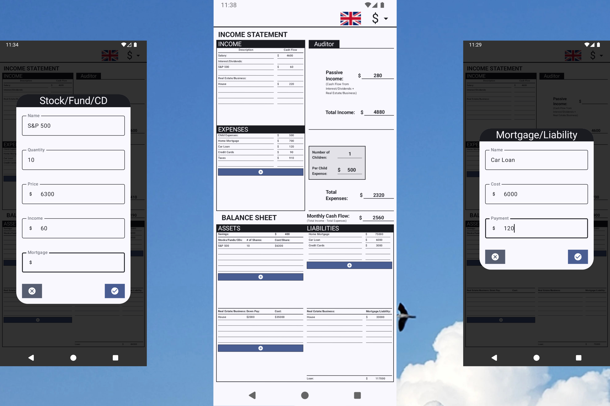

# My Cashflow


> A personal finance tracker built around Robert Kiyosaki's cashflow table — track your income, expenses, assets, and liabilities to understand and grow your cash flow.

---

## Inspiration

This app is directly inspired by **Robert Kiyosaki's *Rich Dad Poor Dad*** and the financial model it introduces through the **Cashflow Table** — a simple but powerful framework that separates the financially free from those working for money.

The cashflow table distinguishes between:

- **Income** — salary (active) and passive income from businesses and stocks
- **Expenses** — monthly outflows including child costs and loan payments
- **Assets** — things that put money *in* your pocket (businesses, stocks, real estate)
- **Liabilities** — things that take money *out* of your pocket (loans, mortgages)

The app digitizes this table so you can fill it in, track your numbers, and watch your cash flow in real time.

<p align="center">
  
</p>

---

## Features

- **Income tracking** — enter your salary and passive income from businesses and stocks
- **Expense management** — add, edit, and delete monthly expenses
- **Asset tracking** — manage businesses and stocks with down payment, cost, income, and mortgage fields
- **Liability tracking** — track loans with cost and monthly payment
- **Real-time Auditor** — automatically calculates total income, total expenses, and net cash flow
- **Multi-currency support** — switch between currencies (USD, EUR, RUB, AMD, and more)
- **Bilingual** — full English and Russian localization
- **Pinch-to-zoom & pan** — navigate the financial sheet with touch gestures
- **Persistent storage** — all data survives app restarts (Room + DataStore)

---

## Architecture

The architecture is heavily inspired by Google's **[Now in Android](https://github.com/android/nowinandroid)** open-source project. It follows the same principles: strict multi-module separation, unidirectional data flow, and scalable Clean Architecture layering.

### Multi-Module Structure

The project is split into independent Gradle modules, each with a single clear responsibility:

```
cashflow/
├── app/                    # Application entry point (MainActivity, Koin init)
├── build-logic/            # Custom Gradle convention plugins
├── core/
│   ├── database/           # Room database (api / impl / entities)
│   ├── datastore/          # DataStore preferences (api / impl)
│   ├── dispatchers/        # Coroutine dispatcher abstraction (api / impl)
│   ├── mvi/                # MVI base classes (ViewModel, Reducer, interfaces)
│   ├── network/            # Retrofit + OkHttp + ErrorManager (api / impl)
│   ├── ui/                 # Shared Composables, Modifier extensions, MVI collectors
│   ├── ui-model/           # UI data models (BusinessUI, StockUI, ExpenseUI, etc.)
│   └── utils/              # Flow, enum, number, format utilities
├── feature/
│   └── home/               # Home screen — full Clean Architecture feature slice
├── middleware/             # App-level cross-cutting use cases (language management)
├── navigation/             # Navigation host and screen graph wiring
└── screens/                # Screens sealed class (type-safe route definitions)
```

Each `core/*` module that has an API/implementation split exposes only an interface to dependents — the implementation is hidden behind the interface boundary, mirroring the Now in Android approach.

### Clean Architecture Layers

Every feature (currently `feature/home`) follows three clear layers:

```
┌──────────────────────────────────────────┐
│            Presentation Layer            │
│   Composables · ViewModel · MVI State   │
├──────────────────────────────────────────┤
│              Domain Layer                │
│      Repository interfaces · Use Cases  │
├──────────────────────────────────────────┤
│               Data Layer                 │
│  Repository impl · DAOs · DataStore     │
└──────────────────────────────────────────┘
```

- **Domain** defines what the app does — repository interfaces and use cases with no Android dependencies
- **Data** knows how to fetch and store data — Room DAOs, DataStore, model converters
- **Presentation** knows how to display state — Jetpack Compose, ViewModel, MVI

### MVI (Model-View-Intent)

The UI layer uses a strict **MVI pattern** built on top of `core/mvi`. Every screen has five dedicated components:

| Component | Role |
|---|---|
| `Intent` | User events sent *into* the ViewModel |
| `Action` | Internal state-change commands emitted by the ViewModel |
| `Reducer` | Pure function — `(Action, State) → State`, no side effects |
| `State` | Single immutable snapshot of everything the UI needs |
| `Effect` | One-time side effects (navigation, snackbars) |

**Unidirectional Data Flow:**

```
  ┌─────────────┐
  │  Composable │◄────────── StateFlow<State>
  └──────┬──────┘
         │ Intent
         ▼
  ┌─────────────────┐
  │   ViewModel     │
  │  handleIntent() │──► Repository / Use Case
  └──────┬──────────┘
         │ Action
         ▼
  ┌─────────────┐
  │   Reducer   │  reduce(action, state) → new State
  └─────────────┘
```

This means the UI is always a pure function of `State`, business logic lives only in the ViewModel, and the Reducer is trivially unit-testable.

### Data Model Layers

Three model types keep each layer independent:

| Suffix | Layer | Purpose |
|---|---|---|
| `UI` (e.g. `BusinessUI`) | Presentation | Compose-friendly, stable, immutable |
| `DBO` (e.g. `BusinessDbo`) | Database | Room `@Entity` — persisted to SQLite |
| `DSO` (e.g. `CashflowDso`) | DataStore | `@Serializable` — persisted to preferences |

Each UI model carries extension functions (`.toDbo()`, `.toDso()`) and the reverse conversions live as extensions on the DBO/DSO types.

### Module Dependency Graph

```
            app
           / | \
     feature  middleware  navigation
        |          |           |
      home     core/ds      screens
       / \
   domain  data
      \   /
    core/*  (mvi, database, datastore, network, ui, ui-model, utils, dispatchers)
```

`feature/*` modules never depend on each other. All shared code lives in `core/*`.

---

## Tech Stack

| Category | Library | Version |
|---|---|---|
| Language | Kotlin | 1.9.24 |
| UI Toolkit | Jetpack Compose | BOM 2024.09.00 |
| Design System | Material3 | 1.3.0 |
| Architecture | MVI + Clean Architecture | — |
| Dependency Injection | Koin + KSP | 3.4.3 |
| Database | Room | 2.6.1 |
| Preferences | DataStore | 1.1.1 |
| Async | Kotlin Coroutines + Flow | 1.8.0 |
| Networking | Retrofit + OkHttp | 2.9.0 / 4.10.0 |
| Serialization | Kotlin Serialization JSON | 1.6.3 |
| Navigation | Navigation Compose (type-safe) | 2.8.0 |
| Image Loading | Coil | 2.6.0 |
| Build System | Custom Gradle Convention Plugins | Gradle 8.13.1 |
| Min SDK | Android 8.0 (API 26) | — |
| Target SDK | Android 14 | — |

---

## Getting Started

### Prerequisites

- Android Studio Ladybug or newer
- JDK 17
- Android SDK with API 34

### Clone & Build

```bash
git clone https://github.com/your-username/cashflow.git
cd cashflow
```

Open the project in Android Studio and let Gradle sync. Then run the `app` configuration on a device or emulator (API 26+).

Alternatively, build from the command line:

```bash
./gradlew :app:assembleDebug
```

---

## License

```
Copyright 2024 Tigran Avdalyan

Licensed under the Apache License, Version 2.0 (the "License");
you may not use this file except in compliance with the License.
You may obtain a copy of the License at

    http://www.apache.org/licenses/LICENSE-2.0
```
